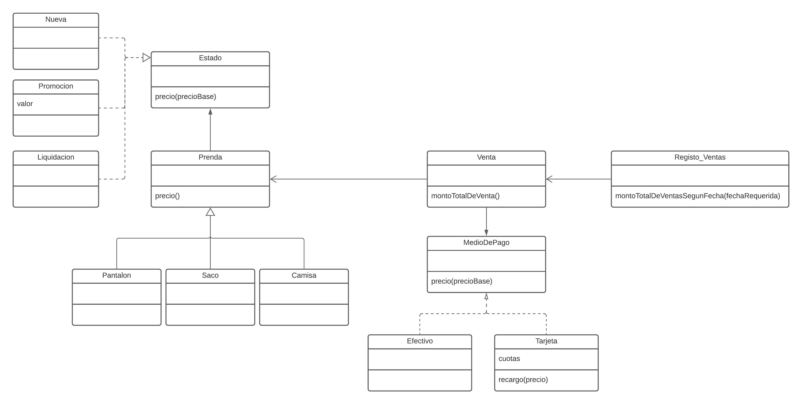

# dds-macowins

# Diagrama de clases 

- - -

# Dudas

1. ¿Elementos del diagrama sin mensajes, porque todos ya conocen los mensajes de la interfaz 
que implementan?
Estado actúaba como interfáz de Nueva/Promoción/Liquidación quienes la implementaban,
mi duda sería era necesario colocar el mensaje precio(precioBase) ? 
Ya que ellos lo entienden, y me pareció innecesario repetirlo en cada uno, 
similar a como si repitiera la lógica en código.

- - -

2. La misma duda me planteo con la superclase Prenda, de la cual heredan 
Pantalón, Saco, y Camisa. Los tres entienden el mensaje precio(),
corresponde en el diagrama agregarlo en cada uno?

- - -

3. ¿En el caso de haber utilizado java, como se deberia haber implementado los estados?
Al utilizar como tecnología Wollok, me limité a usar objetos para los distintos estados
que podía tener una prenda. Mi duda estaría en como debería de haberse planteado en java,
corresponde crear una clase para cada estado, apesar que habría solo una instancia a la
clase? 

- - -

4. Clase abstracta?
Tenía dudas si plantea a Prenda como Clase abstracta porque tiene comportamiento, y mensajes que entienden
las subclases Pantalon/Saco/Camisa que la extienden. Pero requeriría que tenga al menos un método abstracto
que luego esas subclases implementen, y según los requerimientos no veia que fuese necesario.
